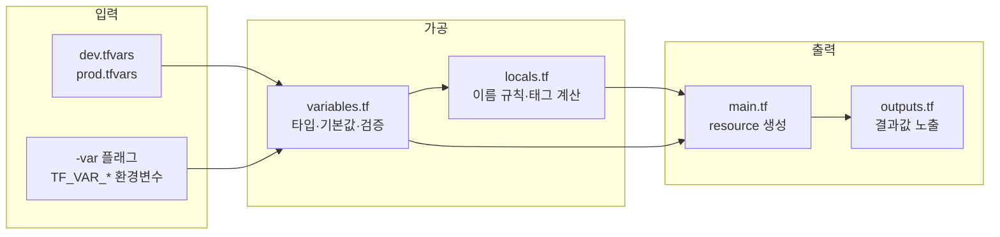



하드코딩된 코드에서 출발해 `variable` → `locals` → `tfvars` 순서로 리팩토링합니다. dev·prod 환경을 동일한 코드 베이스로 배포하는 실무 패턴을 체득하는 것이 목표입니다.

---

## 핵심 데이터 흐름



---

## 실습 구조: Before → After 리팩토링

이 실습은 두 단계로 진행합니다.

| 단계 | 설명 |
|------|------|
| **Before** | 값이 모두 하드코딩된 `main.tf` 하나 |
| **After** | `variables.tf` + `locals.tf` + `dev.tfvars` + `prod.tfvars` 로 분리 |

---

## Before: 하드코딩 버전

```hcl
# main.tf (리팩토링 전 — 안티패턴)
provider "aws" {
  region = "ap-northeast-2"
}

resource "aws_instance" "web" {
  ami           = "ami-0c9c942bd7bf113a2"   # 하드코딩
  instance_type = "t2.micro"                # 환경마다 달라야 하는 값

  tags = {
    Name        = "myapp-dev-web"           # 환경 이름이 코드에 박혀 있음
    Environment = "dev"
    ManagedBy   = "terraform"
  }
}

output "public_ip" {
  value = aws_instance.web.public_ip
}
```


**이 코드의 문제점**: prod 환경에 배포하려면 `dev` → `prod`를 여러 군데 찾아 바꿔야 합니다. 인스턴스 타입도 직접 수정해야 합니다. 파일을 복사해 prod용을 따로 만들면 두 파일이 언제 달라졌는지 추적이 불가능해집니다.


---

## After: 리팩토링 완성본

### 파일 구성

```
lab03-variables/
├── versions.tf
├── providers.tf
├── variables.tf      ← 외부 입력값 선언
├── locals.tf         ← 내부 계산값 정의
├── main.tf           ← 리소스 (변수·locals만 사용)
├── outputs.tf        ← 결과값 노출
├── dev.tfvars        ← dev 환경 입력값
└── prod.tfvars       ← prod 환경 입력값
```

### versions.tf

```hcl
terraform {
  required_version = ">= 1.0.0"

  required_providers {
    aws = {
      source  = "hashicorp/aws"
      version = "~> 5.0"
    }
  }
}
```

### providers.tf

```hcl
provider "aws" {
  region = var.aws_region
}
```

### variables.tf

```hcl
variable "aws_region" {
  description = "AWS 배포 리전"
  type        = string
  default     = "ap-northeast-2"
}

variable "project" {
  description = "프로젝트 이름 (리소스 이름 접두사로 사용)"
  type        = string
  default     = "myapp"
}

variable "environment" {
  description = "배포 환경"
  type        = string
  default     = "dev"

  validation {
    condition     = contains(["dev", "staging", "prod"], var.environment)
    error_message = "environment는 dev, staging, prod 중 하나여야 합니다."
  }
}

variable "instance_type" {
  description = "EC2 인스턴스 타입"
  type        = string
  default     = "t2.micro"
}

variable "ami_id" {
  description = "EC2 AMI ID (ap-northeast-2 Ubuntu 22.04)"
  type        = string
  default     = "ami-0c9c942bd7bf113a2"
}

variable "allowed_ssh_cidr" {
  description = "SSH 접근을 허용할 CIDR 목록"
  type        = list(string)
  default     = ["0.0.0.0/0"]
}

variable "extra_tags" {
  description = "리소스에 추가할 태그"
  type        = map(string)
  default     = {}
}
```

### locals.tf

```hcl
locals {
  # 이름 규칙 중앙화 — 변수가 바뀌면 자동으로 모든 이름이 바뀜
  name_prefix = "${var.project}-${var.environment}"

  # 공통 태그 — 외부 태그와 기본 태그 병합
  common_tags = merge(var.extra_tags, {
    Project     = var.project
    Environment = var.environment
    ManagedBy   = "terraform"
  })

  # 환경별 조건값 — prod에서는 더 큰 인스턴스 사용 가능
  is_prod = var.environment == "prod"
}
```

### main.tf

```hcl
# 보안 그룹
resource "aws_security_group" "web" {
  name        = "${local.name_prefix}-sg"
  description = "Web server security group"

  ingress {
    description = "SSH"
    from_port   = 22
    to_port     = 22
    protocol    = "tcp"
    cidr_blocks = var.allowed_ssh_cidr   # 변수 참조
  }

  ingress {
    description = "HTTP"
    from_port   = 80
    to_port     = 80
    protocol    = "tcp"
    cidr_blocks = ["0.0.0.0/0"]
  }

  egress {
    from_port   = 0
    to_port     = 0
    protocol    = "-1"
    cidr_blocks = ["0.0.0.0/0"]
  }

  tags = merge(local.common_tags, {
    Name = "${local.name_prefix}-sg"
  })
}

# EC2 인스턴스
resource "aws_instance" "web" {
  ami           = var.ami_id
  instance_type = var.instance_type

  vpc_security_group_ids = [aws_security_group.web.id]

  tags = merge(local.common_tags, {   # locals 참조
    Name = "${local.name_prefix}-web"
  })
}
```

### outputs.tf

```hcl
output "instance_id" {
  description = "EC2 인스턴스 ID"
  value       = aws_instance.web.id
}

output "public_ip" {
  description = "EC2 퍼블릭 IP"
  value       = aws_instance.web.public_ip
}

output "environment" {
  description = "배포된 환경 이름"
  value       = var.environment
}

output "name_prefix" {
  description = "리소스 이름 접두사 (locals에서 계산됨)"
  value       = local.name_prefix
}
```

### dev.tfvars

```hcl
project       = "myapp"
environment   = "dev"
instance_type = "t2.micro"
allowed_ssh_cidr = ["0.0.0.0/0"]

extra_tags = {
  CostCenter = "engineering-dev"
}
```

### prod.tfvars

```hcl
project       = "myapp"
environment   = "prod"
instance_type = "t3.small"          # prod는 더 큰 인스턴스
allowed_ssh_cidr = ["10.0.0.0/8"]  # prod는 내부 IP만 SSH 허용

extra_tags = {
  CostCenter  = "engineering-prod"
  Compliance  = "required"
}
```

---

## 실행 절차

{}

### Before 코드로 시작

하드코딩된 `main.tf` 한 파일만 작성해서 먼저 배포해 봅니다.

```bash
mkdir lab03-variables && cd lab03-variables
# Before 버전 main.tf 작성
terraform init
terraform apply -auto-approve
```

`myapp-dev-web` 이름으로 EC2가 생성됩니다. 이제 이걸 리팩토링합니다.

### After 버전으로 리팩토링

위의 After 파일 구성으로 코드를 교체합니다. `main.tf`를 대체하고 `variables.tf`, `locals.tf`, `outputs.tf`, `dev.tfvars`, `prod.tfvars`를 추가합니다.

```bash
# 리팩토링 후 plan — 변경 없음이 목표
terraform plan -var-file=dev.tfvars
```

리팩토링이 올바르게 됐다면 plan 결과가 `No changes` 여야 합니다. 코드만 바뀌고 인프라는 그대로입니다.

### dev 환경 배포

```bash
terraform plan -var-file=dev.tfvars
terraform apply -var-file=dev.tfvars -auto-approve
```

출력 예시:

```
Outputs:
environment  = "dev"
instance_id  = "i-0abc123def456"
name_prefix  = "myapp-dev"
public_ip    = "3.xx.xx.xx"
```

### prod 환경 확인 (plan만)

실제 prod 배포는 하지 않고, plan으로 어떻게 달라지는지만 확인합니다.

```bash
terraform plan -var-file=prod.tfvars
```

`instance_type`이 `t2.micro` → `t3.small`로 변경되는 항목이 표시됩니다. 동일한 코드로 환경별 설정이 달라지는 것을 확인합니다.

### 변수 전달 방법 비교

tfvars 외에 다른 방법도 테스트합니다.

```bash
# 방법 1: -var 플래그 (임시 오버라이드)
terraform plan -var-file=dev.tfvars -var="instance_type=t3.medium"

# 방법 2: 환경변수 (CI/CD에서 자주 사용)
export TF_VAR_environment="staging"
export TF_VAR_instance_type="t2.small"
terraform plan

# 방법 3: validation 오류 확인
terraform plan -var="environment=production"
# Error: "production"은 dev, staging, prod 중 하나여야 합니다.
```

### 리소스 삭제

```bash
terraform destroy -var-file=dev.tfvars
```

{}

---

## 주의사항


**`terraform.tfvars` 자동 로드**: 파일 이름이 `terraform.tfvars`이면 명시적으로 `-var-file`을 지정하지 않아도 자동으로 로드됩니다. `dev.tfvars`, `prod.tfvars` 처럼 이름을 바꾸면 반드시 `-var-file` 플래그가 필요합니다.



**변수 우선순위** (높을수록 나중에 적용): 기본값 → `terraform.tfvars` → `*.auto.tfvars` → `-var-file` → `-var` → 환경변수(`TF_VAR_*`). `-var`로 지정한 값이 tfvars보다 우선합니다.



**민감한 변수**: `sensitive = true`를 붙이면 plan/apply 출력에서 값이 `(sensitive value)`로 가려집니다. DB 비밀번호 등에 사용합니다.

```hcl
variable "db_password" {
  type      = string
  sensitive = true
}
```


---

## 핵심 학습 포인트

**리팩토링 후 `No changes`가 목표**: 코드 구조만 바꾸고 실제 인프라는 그대로 유지되는지 `plan`으로 검증합니다. 이것이 리팩토링이 안전하게 됐다는 증명입니다.

**변수 → locals → resource 흐름**: 외부 입력(`variable`)을 가공하는 곳(`locals`)과 실제 적용하는 곳(`resource`)을 명확히 분리합니다. `main.tf`에 `"${var.project}-${var.environment}"` 같은 조합식이 반복되면 그 즉시 `locals`로 옮깁니다.

**환경별 차이는 tfvars에만**: dev와 prod의 차이는 오직 `*.tfvars` 파일에만 존재해야 합니다. `main.tf`에 `if environment == "prod"` 같은 분기가 생기면 코드 복잡도가 급격히 늘어납니다.

**validation으로 실수 조기 차단**: `contains(["dev", "staging", "prod"], var.environment)` 검증은 `plan` 단계에서 즉시 오류를 냅니다. `apply` 도중 실패하는 것보다 훨씬 안전합니다.

→ 다음 실습: [Lab 04 모듈 만들기](#) — 재사용 가능한 네트워크 모듈 설계
