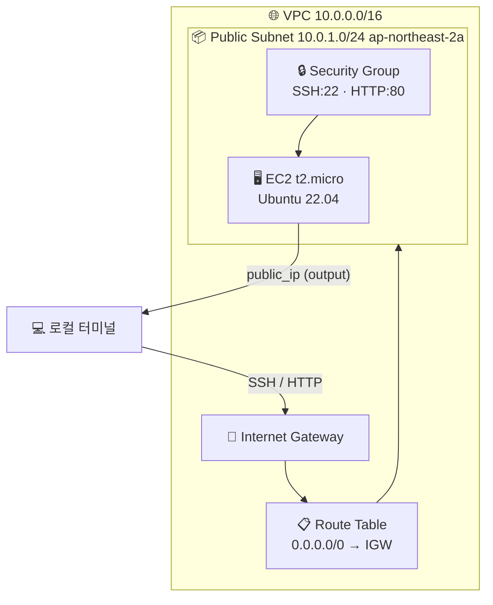



VPC, Subnet, Internet Gateway, Security Group, EC2 인스턴스를 순서대로 구성합니다. 리소스 간 참조와 암시적 의존성이 핵심 학습 포인트입니다.

---

## 구성 아키텍처




Terraform은 리소스 간 **참조**를 보고 생성 순서를 자동 결정합니다. `vpc_id = aws_vpc.main.id` 한 줄이 "VPC가 먼저 만들어져야 Subnet을 만들 수 있다"는 의존성을 표현합니다.


---

## 파일 구성

| 파일 | 역할 |
|------|------|
| `versions.tf` | Terraform 및 AWS 프로바이더 버전 고정 |
| `providers.tf` | AWS 서울 리전 설정 |
| `variables.tf` | 환경 이름, 프로젝트명, 인스턴스 타입 |
| `locals.tf` | 이름 규칙·공통 태그 중앙화 |
| `network.tf` | VPC, Subnet, IGW, Route Table |
| `main.tf` | Security Group, EC2, AMI data source |
| `outputs.tf` | VPC ID, 서브넷 ID, EC2 퍼블릭 IP |

### versions.tf

```hcl
terraform {
  required_version = ">= 1.0.0"

  required_providers {
    aws = {
      source  = "hashicorp/aws"
      version = "~> 5.0"
    }
  }
}
```

### providers.tf

```hcl
provider "aws" {
  region = "ap-northeast-2" # 서울 리전
}
```

### variables.tf

```hcl
variable "project" {
  description = "프로젝트 이름"
  type        = string
  default     = "lab02"
}

variable "environment" {
  description = "배포 환경"
  type        = string
  default     = "dev"
}

variable "instance_type" {
  description = "EC2 인스턴스 타입"
  type        = string
  default     = "t2.micro"
}
```

### locals.tf

```hcl
locals {
  name_prefix = "${var.project}-${var.environment}"

  common_tags = {
    Project     = var.project
    Environment = var.environment
    ManagedBy   = "terraform"
  }
}
```

### network.tf

```hcl
# VPC
resource "aws_vpc" "main" {
  cidr_block           = "10.0.0.0/16"
  enable_dns_hostnames = true
  enable_dns_support   = true

  tags = merge(local.common_tags, {
    Name = "${local.name_prefix}-vpc"
  })
}

# 퍼블릭 서브넷
resource "aws_subnet" "public" {
  vpc_id                  = aws_vpc.main.id   # VPC 참조 → 암시적 의존성
  cidr_block              = "10.0.1.0/24"
  availability_zone       = "ap-northeast-2a"
  map_public_ip_on_launch = true              # 퍼블릭 IP 자동 할당

  tags = merge(local.common_tags, {
    Name = "${local.name_prefix}-public-subnet"
  })
}

# 인터넷 게이트웨이
resource "aws_internet_gateway" "main" {
  vpc_id = aws_vpc.main.id

  tags = merge(local.common_tags, {
    Name = "${local.name_prefix}-igw"
  })
}

# 라우팅 테이블
resource "aws_route_table" "public" {
  vpc_id = aws_vpc.main.id

  route {
    cidr_block = "0.0.0.0/0"
    gateway_id = aws_internet_gateway.main.id
  }

  tags = merge(local.common_tags, {
    Name = "${local.name_prefix}-public-rt"
  })
}

# 라우팅 테이블 ↔ 서브넷 연결
resource "aws_route_table_association" "public" {
  subnet_id      = aws_subnet.public.id
  route_table_id = aws_route_table.public.id
}
```

### main.tf

```hcl
# 최신 Ubuntu 22.04 AMI 조회 (data source)
data "aws_ami" "ubuntu" {
  most_recent = true
  owners      = ["099720109477"] # Canonical 공식 계정

  filter {
    name   = "name"
    values = ["ubuntu/images/hvm-ssd/ubuntu-jammy-22.04-amd64-server-*"]
  }

  filter {
    name   = "virtualization-type"
    values = ["hvm"]
  }
}

# 보안 그룹
resource "aws_security_group" "web" {
  name        = "${local.name_prefix}-sg"
  description = "Allow SSH and HTTP"
  vpc_id      = aws_vpc.main.id   # VPC 참조

  ingress {
    description = "SSH"
    from_port   = 22
    to_port     = 22
    protocol    = "tcp"
    cidr_blocks = ["0.0.0.0/0"]
  }

  ingress {
    description = "HTTP"
    from_port   = 80
    to_port     = 80
    protocol    = "tcp"
    cidr_blocks = ["0.0.0.0/0"]
  }

  egress {
    from_port   = 0
    to_port     = 0
    protocol    = "-1"
    cidr_blocks = ["0.0.0.0/0"]
  }

  tags = merge(local.common_tags, {
    Name = "${local.name_prefix}-sg"
  })
}

# EC2 인스턴스
resource "aws_instance" "web" {
  ami                    = data.aws_ami.ubuntu.id   # data source 참조
  instance_type          = var.instance_type
  subnet_id              = aws_subnet.public.id     # Subnet 참조
  vpc_security_group_ids = [aws_security_group.web.id]

  user_data = <<-EOF
              #!/bin/bash
              apt-get update -y
              apt-get install -y nginx
              echo "<h1>Hello from Terraform Lab 02</h1>" > /var/www/html/index.html
              systemctl start nginx
              systemctl enable nginx
              EOF

  tags = merge(local.common_tags, {
    Name = "${local.name_prefix}-web"
  })
}
```

### outputs.tf

```hcl
output "vpc_id" {
  description = "생성된 VPC ID"
  value       = aws_vpc.main.id
}

output "public_subnet_id" {
  description = "퍼블릭 서브넷 ID"
  value       = aws_subnet.public.id
}

output "instance_id" {
  description = "EC2 인스턴스 ID"
  value       = aws_instance.web.id
}

output "public_ip" {
  description = "EC2 퍼블릭 IP"
  value       = aws_instance.web.public_ip
}

output "web_url" {
  description = "Nginx 웹서버 접근 URL"
  value       = "http://${aws_instance.web.public_ip}"
}
```

---

## 실행 절차

{}

### 디렉터리 생성 및 파일 작성

```bash
mkdir lab02-vpc-ec2 && cd lab02-vpc-ec2
# 위 파일 7개 작성
```

### 초기화 — terraform init

```bash
terraform init
```

### 계획 확인 — terraform plan

생성 예정 리소스 목록을 확인합니다.

```bash
terraform plan
```

총 **8개** 리소스가 표시되어야 합니다:
`aws_vpc` · `aws_subnet` · `aws_internet_gateway` · `aws_route_table` · `aws_route_table_association` · `aws_security_group` · `aws_instance` · `data.aws_ami`

### 배포 — terraform apply

```bash
terraform apply

# 확인 없이 자동 승인 (CI/CD 환경)
terraform apply -auto-approve
```

완료 후 출력 예시:

```
Apply complete! Resources: 7 added, 0 changed, 0 destroyed.

Outputs:
instance_id       = "i-0a1b2c3d4e5f67890"
public_ip         = "43.201.xx.xx"
public_subnet_id  = "subnet-0abc123def456"
vpc_id            = "vpc-0123456789abcdef0"
web_url           = "http://43.201.xx.xx"
```

EC2 기동 후 nginx가 시작되기까지 1~2분 소요됩니다.

```bash
# nginx 응답 확인
curl http://<public_ip>
# <h1>Hello from Terraform Lab 02</h1>
```

### 리소스 삭제 — terraform destroy

```bash
terraform destroy
```

`yes` 입력 시 8개 리소스가 역순으로 안전하게 삭제됩니다.

{}

---

## 주의사항


**AWS 자격증명 필수**: `aws configure` 또는 환경변수 `AWS_ACCESS_KEY_ID` / `AWS_SECRET_ACCESS_KEY` 설정이 필요합니다.



**AMI 자동 조회**: `data "aws_ami"` 블록이 Canonical 계정의 최신 Ubuntu 22.04를 자동으로 찾습니다. AMI ID를 하드코딩하지 않아도 됩니다.



**비용**: t2.micro는 프리 티어 대상입니다. Elastic IP를 생성하지 않았으므로 인스턴스 재시작 시 퍼블릭 IP가 변경됩니다.


---

## 핵심 학습 포인트

**암시적 의존성과 생성 순서**: `aws_subnet`이 `aws_vpc.main.id`를 참조하기 때문에 Terraform이 자동으로 VPC → Subnet → IGW → Route Table → EC2 순서로 생성합니다. `depends_on`을 직접 쓰지 않아도 됩니다.

```
data.aws_ami.ubuntu  (조회)
aws_vpc.main         ──→  aws_subnet.public
                     ──→  aws_internet_gateway.main  ──→  aws_route_table.public
                                                     ──→  aws_route_table_association.public
                     ──→  aws_security_group.web
                                                          aws_instance.web  (마지막)
```

**`data` vs `resource`**: AMI는 내가 만드는 게 아니라 AWS가 제공하는 것 → `data` 사용. VPC, EC2 등 내가 직접 만드는 것 → `resource` 사용.

**locals로 이름 규칙 통일**: `local.name_prefix`를 모든 리소스 Name 태그에 적용해 `lab02-dev-vpc`, `lab02-dev-sg` 같이 일관된 이름이 붙습니다.

**output 체이닝**: `web_url = "http://${aws_instance.web.public_ip}"` — output 안에서 다른 리소스 속성을 참조해 조합할 수 있습니다.

→ 다음 실습: [Lab 03 변수와 Outputs 실습](#) — 하드코딩된 값을 변수로 교체하는 리팩토링
