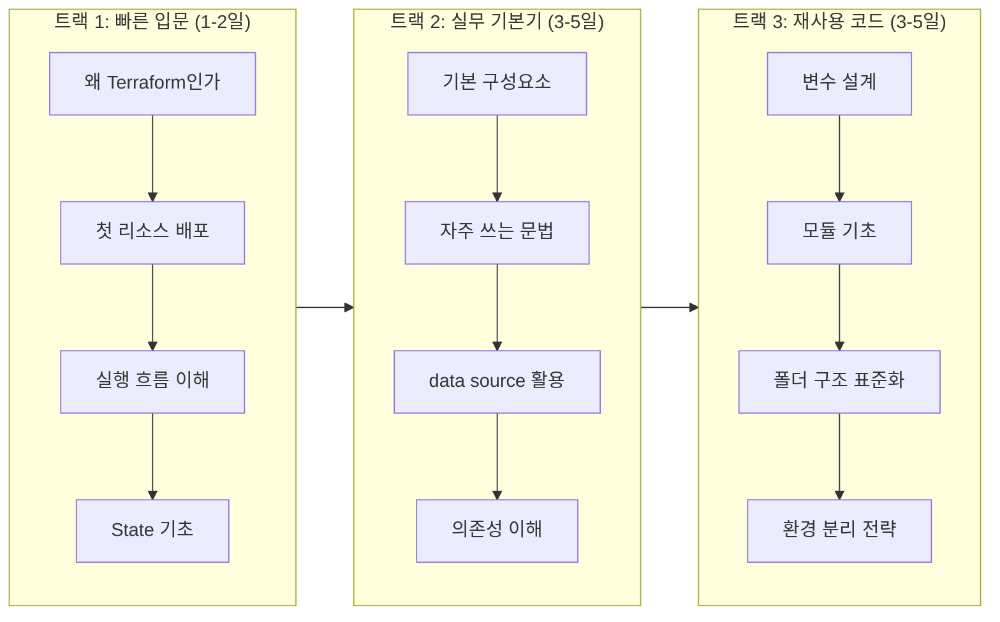

역할과 목표에 맞는 학습 경로를 선택하세요. 처음부터 끝까지 순서대로 볼 필요는 없습니다.

## 트랙별 추천 순서

## 트랙 1: 빠른 입문

**목표**: Terraform이 왜 필요한지 이해하고 첫 리소스를 직접 배포  
**소요 시간**: 1-2일

| 순서 | 주제 | 링크 |
|------|------|------|
| 1 | Terraform을 왜 배워야 하는가 | [바로가기](/docs/01-intro/why-terraform) |
| 2 | 첫 번째 리소스 배포 (15분) | [바로가기](/docs/01-intro/first-deploy) |
| 3 | Terraform 실행 흐름 완전 이해 | [바로가기](/docs/01-intro/workflow) |
| 4 | State를 처음부터 제대로 이해하기 | [바로가기](/docs/01-intro/state-intro) |

## 트랙 2: 실무 기본기

**목표**: 현업에서 바로 쓰는 핵심 개념과 문법 습득  
**소요 시간**: 3-5일

| 순서 | 주제 | 링크 |
|------|------|------|
| 1 | Terraform 기본 구성요소 | [바로가기](/docs/02-basics/components) |
| 2 | 자주 쓰는 문법 빠르게 익히기 | [바로가기](/docs/02-basics/syntax) |
| 3 | 실무 실행 흐름 (init/plan/apply) | [바로가기](/docs/02-basics/execution-flow) |
| 4 | data source로 기존 인프라 참조 | [바로가기](/docs/02-basics/data-sources) |
| 5 | 의존성 이해 | [바로가기](/docs/02-basics/dependencies) |

## 트랙 3: 재사용 가능한 코드

**목표**: 팀이 함께 쓸 수 있는 재사용 가능한 모듈형 코드 작성  
**소요 시간**: 3-5일

| 순서 | 주제 | 링크 |
|------|------|------|
| 1 | 변수 설계와 입력값 관리 | [바로가기](/docs/03-reusable/variables) |
| 2 | 모듈 기초 | [바로가기](/docs/03-reusable/modules) |
| 3 | 폴더 구조 표준화 | [바로가기](/docs/03-reusable/folder-structure) |
| 4 | 환경 분리 전략 | [바로가기](/docs/03-reusable/environment-separation) |

## 트랙 4: 팀 협업

**목표**: Remote State, Locking, Import로 팀 운영 기반 구축  
**소요 시간**: 2-3일

| 순서 | 주제 | 링크 |
|------|------|------|
| 1 | Remote State와 Locking | [바로가기](/docs/04-team/remote-state) |
| 2 | 기존 인프라 Terraform 편입 | [바로가기](/docs/04-team/import) |
| 3 | Drift Detection | [바로가기](/docs/04-team/drift-detection) |
| 4 | 팀 협업 워크플로우 | [바로가기](/docs/04-team/workflow) |

## 트랙 5: 운영 자동화

**목표**: CI/CD 파이프라인에 Terraform을 연결해 자동화된 배포 구축  
**소요 시간**: 3-5일

| 순서 | 주제 | 링크 |
|------|------|------|
| 1 | Terraform과 CI/CD 연결 | [바로가기](/docs/05-cicd/cicd-integration) |
| 2 | GitHub Actions 자동화 | [바로가기](/docs/05-cicd/github-actions) |
| 3 | 비밀정보 관리 | [바로가기](/docs/05-cicd/secrets-management) |
| 4 | 실패 방지 장치 | [바로가기](/docs/05-cicd/safety-gates) |

## 트랙 6: 고급 운영

**목표**: 대규모 조직에서 Terraform을 확장하는 설계 역량 확보  
**소요 시간**: 5-7일

| 순서 | 주제 | 링크 |
|------|------|------|
| 1 | 모듈 설계 고도화 | [바로가기](/docs/06-advanced/module-design) |
| 2 | 멀티 계정/리전 전략 | [바로가기](/docs/06-advanced/multi-account) |
| 3 | 대규모 State 분할 | [바로가기](/docs/06-advanced/state-splitting) |
| 4 | 보안·거버넌스 | [바로가기](/docs/07-security) |
| 5 | 트러블슈팅 심화 | [바로가기](/docs/08-ops) |

---

## 대상별 추천 트랙

| 역할 | 추천 트랙 | 우선순위 주제 |
|------|----------|-------------|
| **처음 배우는 개발자** | 트랙 1 → 트랙 2 | 빠른 입문, 기본기 |
| **DevOps 엔지니어** | 트랙 1 → 2 → 4 → 5 | 협업, CI/CD 자동화 |
| **SRE** | 트랙 4 → 5 → 8단계 | Drift 대응, 트러블슈팅 |
| **플랫폼 팀** | 트랙 3 → 6 → 7단계 | 모듈 설계, 거버넌스 |
| **팀 리드** | 트랙 3 → 4 → 7단계 | 표준화, 협업, 정책 통제 |
